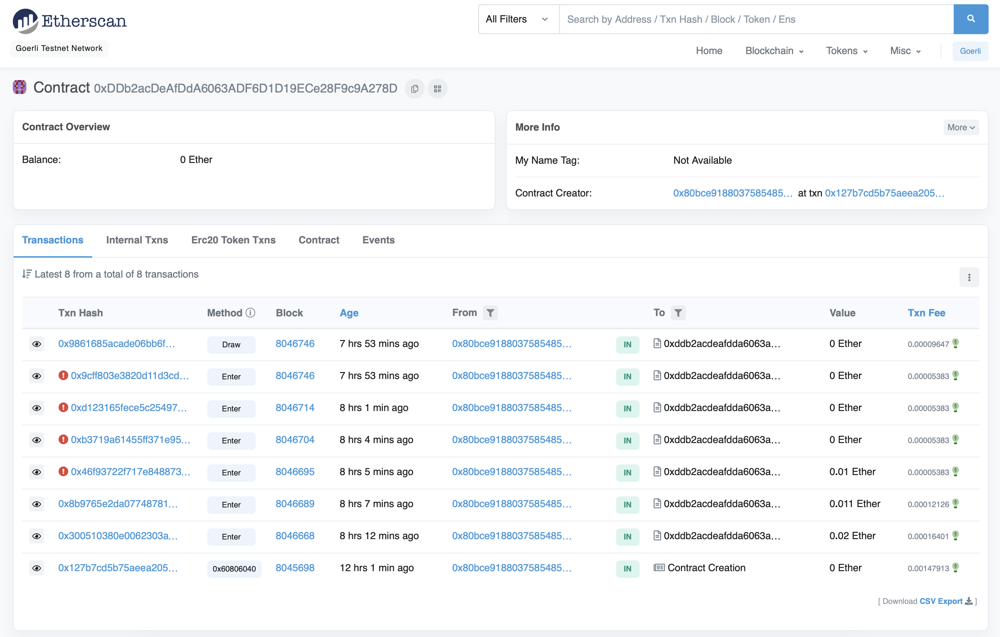

<h2 align="center">Truffle and React.js Template - Lottery Contract</h2> <br>
<p align="center">
  
</p>
<p align="center">Rapid Ethereum Dapp Development</p>

<p align="center">
  
  
</p>

---

You can explore this contract on TESTNET Goerli (GTH) Blockchain Explorer (Etherscan) at [here](https://goerli.etherscan.io/address/0xDDb2acDeAfDdA6063ADF6D1D19ECe28F9c9A278D)

---

## Smart Contract Lottery Development with Create-React-App

How does this differ from the official React Truffle Box?

- **No ejection** required;
- **React frontend** is located in its own separate folder (i.e. [`/client`](https://github.com/minhtran241/lottery-contract-truffle-react/tree/main/client));
- **Babel** is included so you can use ES6 module import statements;
- Uses **Truffle 5.6**
- Uses **Web3 1.6**

If you have Truffle installed, run the following to get started (more detailed instructions below):

---

## Install Truffle globally

```sh
npm install -g truffle
```

## Testing

First, make sure Ganache is running

```sh
yarn ganache
```

Compile

```sh
yarn compile
```

Run all tests

```sh
yarn test
```

To run tests in a specific file, run

```sh
yarn test [path/to/file]
```

Deploy by connecting to Infura node (specific provider)

**Note:** You have to set up all the environment variables before doing this step

```sh
yarn deploy
```
